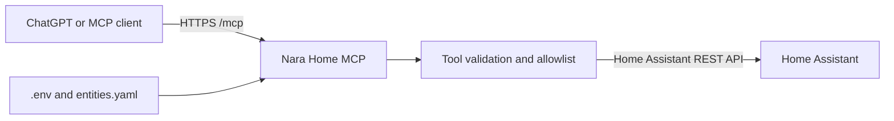

# Nara Home MCP

Nara Home MCP is a focused Model Context Protocol server that lets ChatGPT read selected Home Assistant data and perform a small set of explicitly approved home-control actions. It replaces broad Home Assistant access with named tools, aliases, and an allowlist that keeps the exposed surface understandable and auditable.

## Architecture



The server uses MCP Streamable HTTP on `/mcp`. Configuration is loaded from environment variables and a YAML entity map. A small asynchronous client communicates with the Home Assistant REST API using a Home Assistant access token.

## Features and tools

Nara Home MCP currently exposes 18 tools.

### State and presence

- `ha_get_state` reads one explicitly allowed entity.
- `ha_get_temperature` reads the temperature for a configured room or climate location.
- `ha_get_overnight_temperature` summarizes minimum, maximum, and average temperature between 23:00 and 08:00.
- `ha_get_presence` summarizes configured presence sensors.

### Climate and home health

- `ha_get_climate_summary` returns configured temperature, humidity, and battery readings.
- `ha_get_battery_summary` reports configured batteries and detects values below a configurable threshold.
- `ha_get_ups_summary` summarizes configured UPS sensors.
- `ha_get_home_health_summary` combines climate, batteries, UPS, and infrastructure data.

### Infrastructure

- `ha_get_proxmox_summary` summarizes configured Proxmox sensors.
- `ha_get_nas_summary` summarizes configured NAS sensors.
- `ha_get_infra_summary` returns the combined Proxmox and NAS view.

### Limited control

- `ha_turn_on` turns on an allowlisted light.
- `ha_turn_off` turns off an allowlisted light.
- `ha_set_light_brightness` changes the brightness of an allowlisted light.
- `ha_set_display_brightness` changes the brightness of an allowlisted display entity.
- `ha_run_scene` activates an allowlisted scene.

### Discovery and diagnostics

- `ha_list_allowed_entities` lists the aliases and entities available through the server.
- `ha_get_server_version` returns runtime and tool-catalog diagnostics.

## Security model

The entity configuration is a static allowlist by default. With `ALLOW_DYNAMIC_ENTITIES=false`, only entities declared in `entities.yaml` can be read through `ha_get_state`. Dynamic discovery must be enabled explicitly and is not recommended for a tightly controlled deployment.

Control tools do not accept arbitrary Home Assistant services. They are limited to configured lights, displays, and scenes, and their resolvers reject targets outside the corresponding allowlist.

The Home Assistant token is read from `.env`, used as a bearer token for the Home Assistant API, and must never be committed. Use a dedicated Home Assistant account and the minimum permissions suitable for the deployment.

> **Warning:** Do not expose the MCP endpoint to the public Internet without appropriate authentication and access controls. HTTPS encrypts traffic but does not, by itself, authorize clients.

## Requirements

- Python 3.11
- A reachable Home Assistant instance
- A Home Assistant access token
- Network access from the MCP host to Home Assistant
- An authenticated HTTPS endpoint when connecting from ChatGPT

## Quick installation

```bash
python3 -m venv .venv
. .venv/bin/activate
python -m pip install -r requirements.txt
cp .env.example .env
cp config/entities.example.yaml config/entities.yaml
```

Edit `.env` and change `ENTITIES_FILE` to `config/entities.yaml`. Then replace all fictional values in `config/entities.yaml` with aliases and entity IDs from your own Home Assistant installation.

## Configuration

The main environment settings are:

- `HA_URL`: base URL of Home Assistant.
- `HA_TOKEN`: Home Assistant access token.
- `MCP_HOST` and `MCP_PORT`: local bind address and port.
- `ENTITIES_FILE`: path to the private entity configuration.
- `ALLOW_DYNAMIC_ENTITIES`: keep `false` for a static allowlist.
- `ALLOWED_HOSTS` and `ALLOWED_ORIGINS`: optional transport-security restrictions.

Use `.env.example` as the environment template and `config/entities.example.yaml` as the entity-map template. The example values are fictional and are safe to replace locally. Do not commit the resulting `.env` or `config/entities.yaml` files.

## Run the server

```bash
python -m app.main
```

With the default settings, the MCP endpoint is available locally at:

```text
http://127.0.0.1:8000/mcp
```

The repository also includes a generalized systemd unit in `systemd/nara-mcp.service` for a persistent Linux deployment.

## Connect from ChatGPT

Place the server behind an authenticated HTTPS reverse proxy or tunnel that forwards to the local MCP service without opening the local port directly. The external URL must include the MCP path, for example:

```text
https://mcp.example.invalid/mcp
```

Enable Developer Mode in ChatGPT, create a developer-mode app, enter the HTTPS MCP URL, and verify that ChatGPT discovers the 18 tools listed above. OpenAI's current connection flow is documented in [Connect from ChatGPT](https://developers.openai.com/apps-sdk/deploy/connect-chatgpt).

## Usage examples

After replacing the sample aliases with your own configuration, prompts can be as simple as:

```text
What is the temperature in sample_room?
```

```text
Give me a home health summary, including low batteries and the UPS.
```

```text
Set sample_lamp to 40% brightness.
```

## Tests

Install the requirements, then run:

```bash
pytest
```

The suite covers entity resolution, allowlist behavior, Home Assistant client requests, infrastructure summaries, climate and battery summaries, overnight history, light controls, OAuth metadata, and the MCP tool inventory.

## How it was built

Nara Home MCP was directed by Juan Pedro, with Codex used for implementation and ChatGPT used for architecture, debugging, and documentation. It has been tested against a real Home Assistant installation.

## Project status

The project is functional and used in a production home environment. It is presented here as a personal project, with fictional public configuration examples and deployment-specific data kept private.
